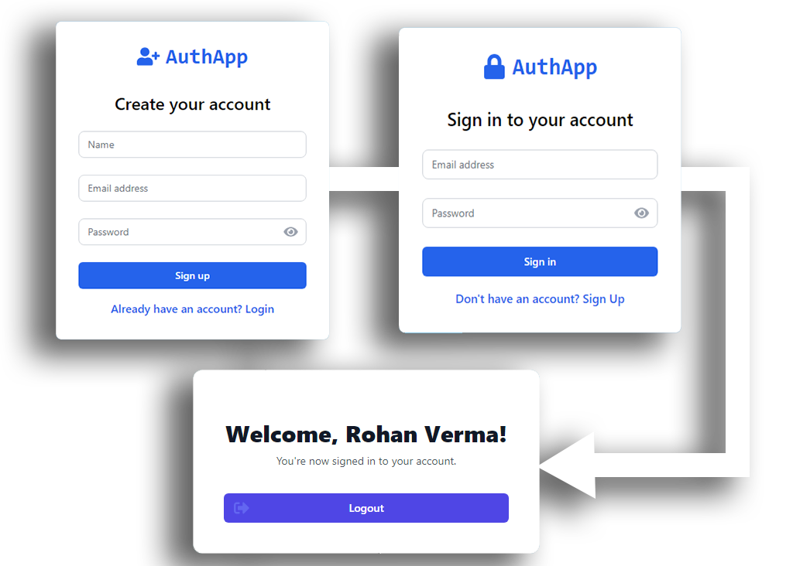
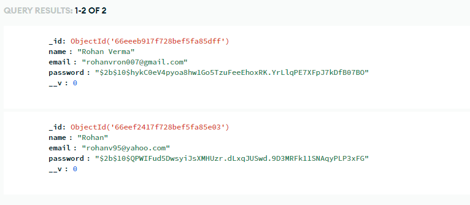

# AuthApp - Authentication System

AuthApp is a authentication system built with modern web technologies, providing secure user registration, login functionality.

## Features

- User registration with email and password
- Secure login system
- Protected dashboard route
- Password visibility toggle
- Responsive design for various screen sizes

## Technologies Used

  

### Frontend
- React.js for building user interfaces
- Vite as the build tool and development server
- Redux Toolkit for state management
- React Router for navigation
- Axios for API requests
- Framer Motion for animations
- React Icons for UI icons
- React Hot Toast for notifications
- Tailwind CSS for styling

  

### Backend
- Node.js runtime
- Express.js web framework
- MongoDB for database storage
- Mongoose for object modeling
- JSON Web Tokens (JWT) for authentication
- Bcrypt for password hashing
- Cors for cross-origin resource sharing
- Dotenv for environment variable management

## System Overview

AuthApp is a full-stack application with a React frontend and Node.js backend:

- The frontend uses React with Redux for state management, providing a smooth user experience with features like form validation and toast notifications.
- The backend uses Express.js to handle API requests, MongoDB for data storage, and implements JWT for secure authentication.
- User passwords are hashed using bcrypt before storage for enhanced security.
- The application features protected routes, ensuring only authenticated users can access the dashboard.

## API Endpoints

- POST /api/auth/signup - User registration
- POST /api/auth/login - User login

## Deployment

- Frontend: Cloudflare pages
- Backend: Vercel
- Database: MongoDB Atlas

## Additional Information

- The project uses ESLint for code linting and Prettier for code formatting.
- Tailwind CSS is used for responsive design and custom styling.
- The application is set up for easy deployment on Vercel, with configuration provided in `vercel.json`.

## Setup Instructions

1. Clone the repository: 
`git clone https://github.com/rohanvron/auth-app.git`

2. Install dependencies: 
`npm install cd frontend && npm install cd ../backend && npm install`

3. Set up environment variables:
Create a `.env` file in the `backend` directory with the following content:
`MONGODB_URI=your_mongodb_connection_string JWT_SECRET=your_jwt_secret PORT=5000` and smtp credentials.

4. Start the backend server:
`cd backend npm start`

5. In a new terminal, start the frontend development server:
`cd frontend npm run dev`

6. Open your browser and navigate to `http://localhost:5173` to view the application.